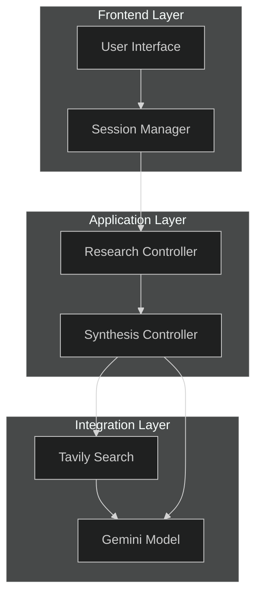
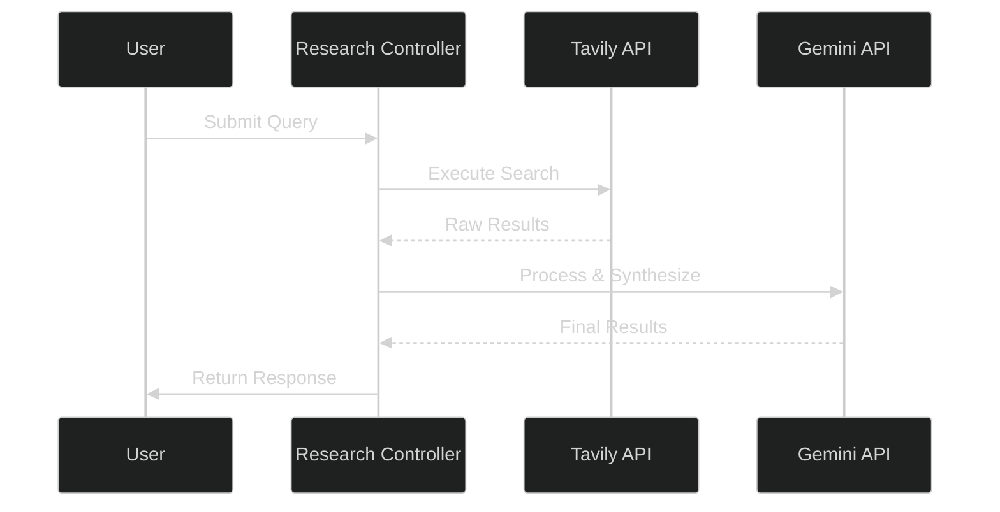
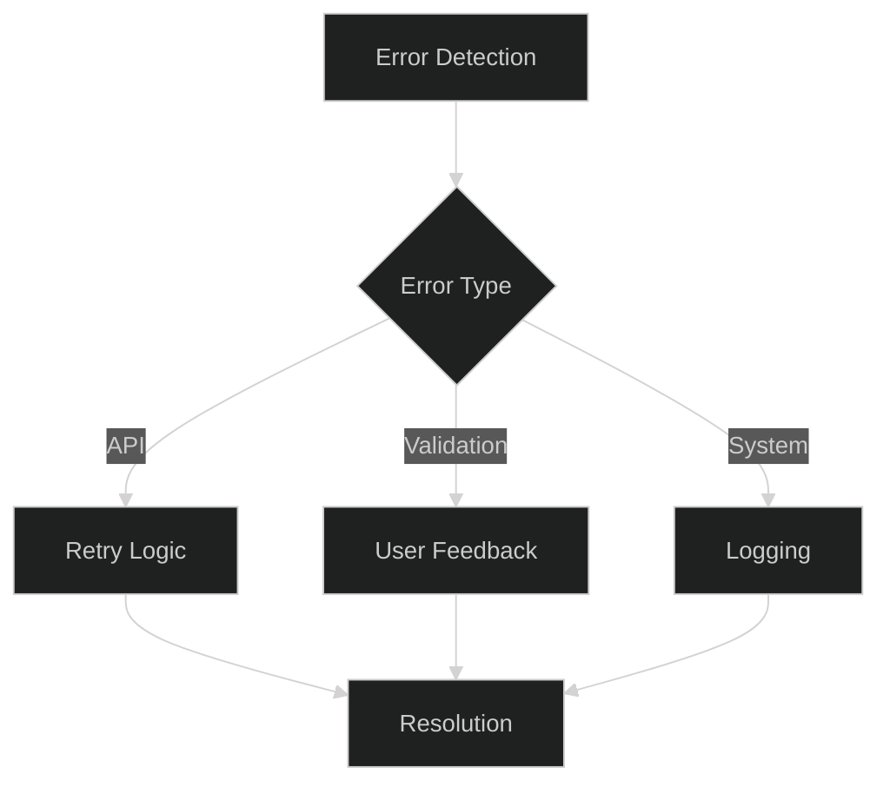

# Deep Research Assistant

**Current Date and Time (UTC):** 2025-02-28 13:45:49  
**Current User:** srikrishnavansi  
**Version:** 1.0.0  

## System Architecture

### High-Level Overview


## Core Components

### 1. Research System Flow


### 2. Data Processing Pipeline


## Core Features

### 1. Research Capabilities
- Basic Research Mode
  - Quick surface-level analysis
  - Key points extraction
  - Summary generation

- Advanced Research Mode
  - In-depth analysis
  - Comprehensive data gathering
  - Detailed synthesis

### 2. Data Processing
- Query validation and preprocessing
- Multi-source research integration
- AI-powered synthesis
- Result caching and optimization

### 3. Result Management
- Structured data format
- History tracking
- Cache management
- Error handling

## Technical Implementation

### 1. Core Configuration
```python
class Settings(BaseSettings):
    # API Keys
    tavily_api_key: SecretStr
    google_api_key: SecretStr
    
    # Research Settings
    max_results_per_query: int = 10
    search_depth: SearchDepth = SearchDepth.BASIC
    max_retries: int = 3
    
    # Session Info
    current_timestamp: datetime = "2025-02-28 13:45:49"
    current_user: str = "srikrishnavansi"
```

### 2. Error Handling Strategy


## System Requirements

### Software
- Python 3.8+
- Required APIs:
  - Tavily Search API
  - Google Gemini API

### Hardware
- RAM: 4GB minimum
- Storage: 1GB minimum
- Stable internet connection

### Dependencies
```plaintext
streamlit>=1.24.0
pydantic>=2.0.0
requests>=2.31.0
python-dotenv>=1.0.0
```

## Development Roadmap

### Phase 1 (Completed)
✅ Core research functionality
✅ API integrations
✅ Basic synthesis
✅ Error handling

### Phase 2 (Current)
🔄 Advanced caching
🔄 Multiple research strategies
🔄 Performance optimization

### Phase 3 (Planned)
📅 Machine learning integration
📅 Custom research templates
📅 Advanced analytics

## Project Structure
```
deep_research/
├── app.py                  # Main application
├── config.py              # Configuration
├── static/                # Static assets
├── agents/                # Core agents
│   ├── research_agent.py
│   └── synthesis_agent.py
├── models/                # Data models
├── utils/                 # Utilities
├── requirements.txt
└── README.md
```

## Getting Started

1. Clone the repository
2. Create .env file:
```plaintext
TAVILY_API_KEY=your-tavily-api-key
GOOGLE_API_KEY=your-google-api-key
```

3. Install dependencies:
```bash
pip install -r requirements.txt
```

4. Run the application:
```bash
streamlit run app.py
```

## Documentation

Detailed documentation available for:
- API Integration
- Research Strategies
- Data Models
- Error Handling
- Cache Management
- Results Processing

## Contributing

Please refer to CONTRIBUTING.md for:
- Code standards
- Pull request process
- Development guidelines
